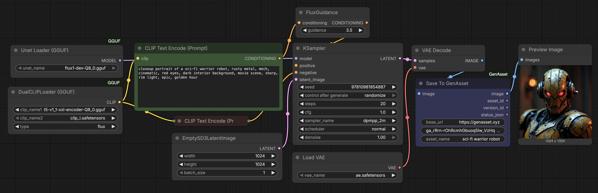

# ComfyUI-GenAsset

[](LICENSE)
[](https://github.com/comfyanonymous/ComfyUI)
[](https://www.genasset.xyz/)

ComfyUI nodes for saving, loading, and versioning image generations in **GenAsset**.

GenAsset keeps the output image together with the recipe (prompt, model, seed, sampler/scheduler, workflow JSON, metadata), so teams and agents can reproduce and reuse results reliably.

## Start Free

Create your GenAsset workspace and token at:

- **https://www.genasset.xyz/**

## Example: Save From ComfyUI To GenAsset

A Flux GGUF txt2img workflow using **Save To GenAsset**.



## Why Use This Node Pack

- Save generation outputs as reusable, versioned assets.
- Load exact versions later for edits or replay.
- Compare versions and capture metadata changes.
- Branch/fork creative directions without losing lineage.
- Upload upstream `LoadImage` inputs as GenAsset input artifacts when available.
- Enable safer handoff between humans and AI agents.

## Included Nodes

Category in ComfyUI:

```text
genasset
```

### Node Reference

| Node | What it does | Inputs | Outputs |
| --- | --- | --- | --- |
| `Test GenAsset Connection` | Checks that ComfyUI can reach GenAsset and that the workspace token is valid. Use this first when setting up a workflow. | `base_url`, `token` | `workspace_name`, `status_json`, `summary`, `state`, `normalized_status_json` |
| `GenAsset Workflow Assistant` | Validates a workflow and suggests optional prefill fields such as asset name, tags, intent, notes, version label, and metadata. Wire its outputs into `Save To GenAsset`. | `base_url`, `token`; optional `image`, `asset_name_hint`, `asset_id_hint` | `asset_name`, `asset_id`, `tags_csv`, `intent`, `notes_md`, `version_label`, `metadata_json`, `warnings_json`, `status_json`, `summary` |
| `Save To GenAsset` | Saves a generated image as a GenAsset version with prompt, model, seed, workflow JSON, metadata, and optional assistant-prefilled fields. | `image`, `base_url`, `token`, `asset_name`; optional `asset_id`, `tags_csv`, `intent`, `notes_md`, `version_label`, `metadata_json`, `source` | image passthrough, `asset_id`, `version_id`, `status_json` |
| `Load Asset From GenAsset` | Loads a preview image and recipe metadata. Can load an exact version, an asset's current/latest version, or the latest updated asset in the workspace. | `base_url`, `token`, optional `asset_id`, optional `version_id` | `image`, `asset_id`, `version_id`, `workflow_json`, `metadata_json`, `status_json` |
| `Load Version From GenAsset` | Loads one exact historical version by version id. | `base_url`, `token`, `version_id` | `image`, `asset_id`, `version_id`, `workflow_json`, `metadata_json`, `status_json` |
| `Save Metadata Patch To GenAsset` | Merges a JSON metadata patch into an existing version without uploading a new image. | `base_url`, `token`, `version_id`, `metadata_patch_json` | `version_id`, `metadata_json`, `status_json` |
| `Compare Two GenAsset Versions` | Loads two versions and returns both previews plus a JSON diff of key recipe fields. | `base_url`, `token`, `left_version_id`, `right_version_id` | `left_image`, `right_image`, `diff_json`, `status_json` |
| `Create Branch Version In GenAsset` | Creates a new version connected to a parent version, useful for branching experiments. | `image`, `base_url`, `token`, `asset_id`, `parent_version_id`, `asset_name`, `prompt_text`, `negative_prompt_text`, `model_name`, `seed`, `tags_csv`, `intent`, `extra_metadata_json` | image passthrough, `asset_id`, `version_id`, `status_json` |
| `Load Recipe To Widgets` | Extracts replay-friendly widget values from stored `workflow_json` and `metadata_json`. | `workflow_json`, `metadata_json` | `prompt_text`, `negative_prompt_text`, `model_name`, `seed`, `steps`, `cfg`, `sampler_name`, `scheduler`, `denoise`, `width`, `height`, `status_json` |
| `Find Assets In GenAsset` | Searches assets in the current workspace. | `base_url`, `token`, `search_query`, `page`, `page_size` | `assets_json`, `asset_ids_csv`, `status_json` |
| `List Asset Versions In GenAsset` | Lists versions for a specific asset. | `base_url`, `token`, `asset_id`, `max_versions` | `versions_json`, `version_ids_csv`, `status_json` |
| `Load Current Version For Asset` | Loads the current/latest version for one asset id. | `base_url`, `token`, `asset_id` | `image`, `asset_id`, `version_id`, `workflow_json`, `metadata_json`, `status_json` |
| `Promote Version In GenAsset` | Promotes a selected version to be the current version for an asset. | `base_url`, `token`, `asset_id`, `version_id` | `asset_id`, `version_id`, `status_json` |
| `Delete Version In GenAsset` | Deletes a GenAsset version. | `base_url`, `token`, `version_id`, `confirm_delete` | `version_id`, `status_json` |
| `Fork Asset From Version In GenAsset` | Creates a new asset from an existing source version. | `base_url`, `token`, `source_version_id`, `new_asset_name`, `prompt_suffix`, `negative_prompt_override`, `tags_csv`, `intent`, `extra_metadata_json` | `image`, `asset_id`, `version_id`, `status_json` |
| `Create Asset In GenAsset` | Creates a new GenAsset asset and initial version from a supplied image. | `image`, `base_url`, `token`, `asset_name`, `prompt_text`, `negative_prompt_text`, `model_name`, `seed`, `tags_csv`, `intent`, `extra_metadata_json` | image passthrough, `asset_id`, `version_id`, `status_json` |
| `Rename Asset In GenAsset` | Renames an existing asset. | `base_url`, `token`, `asset_id`, `new_name` | `asset_id`, `asset_name`, `status_json` |
| `Upsert Asset Tags Fields` | Updates asset-level fields such as tags and notes. | `base_url`, `token`, `asset_id`, `tags_csv`, `notes_md` | `asset_id`, `asset_json`, `status_json` |
| `Asset Summary In GenAsset` | Fetches compact summary information for one asset. | `base_url`, `token`, `asset_id` | `summary`, `asset_json`, `status_json` |

### Save Capture

`Save To GenAsset` captures the following automatically when the graph exposes it:

- prompt and negative prompt
- Qwen/Kontext edit prompts from prompt-bearing nodes
- zeroed negative conditioning as blank negative prompt
- checkpoint/model name
- seed, steps, cfg, sampler, scheduler, denoise
- image size and batch size
- upstream node ids
- input images from upstream `LoadImage` nodes, uploaded as GenAsset input artifacts when the files are available in the ComfyUI input folder
- ComfyUI API prompt and workflow JSON, with token-like fields redacted
- basic tags derived from the prompt/model
- image quality metrics

It refuses to save blank or near-black frames. In that case it returns a status JSON explaining the rejection instead of creating a bad version.

### Load Behavior

- If `version_id` is set: loads that exact version.
- Else if `asset_id` is set: loads the current/latest version of the matched asset.
- Else (both empty): loads the latest updated asset in the workspace.

`asset_id` should be the exact asset id (UUID). Leave it empty to load the latest asset in the workspace.

## Installation

### Option 1: ComfyUI Manager

After publication in the registry, open ComfyUI Manager and search:

```text
GenAsset
```

Install and restart ComfyUI.

If you are loading a workflow that contains GenAsset nodes, ComfyUI-Manager's missing-node installer should resolve those node types to the `genasset` package from the default channel.

### Option 2: Manual Install

From your ComfyUI folder:

```bash
cd custom_nodes
git clone https://github.com/steliosot/ComfyUI-GenAsset.git
```

Restart ComfyUI.

## Quick Start (2 minutes)

1. In GenAsset, create a workspace token (`Settings -> Tokens`).
2. In ComfyUI, add `Test GenAsset Connection` and confirm status is successful.
3. Add `Save To GenAsset` to any image workflow and set:

```text
base_url = https://genasset.xyz
token = PASTE_TOKEN
asset_name = your asset name
```

4. Queue prompt. You should get `asset_id`, `version_id`, and a valid status JSON.

## GenAsset Manager

After installing or updating this node pack, restart ComfyUI and click `GenAsset` in the top toolbar, next to Manager.

The panel can test your GenAsset connection, show recent assets, and import public or workspace workflows. Choose a workflow and click `Import`. The workflow is loaded onto the canvas, but it is not queued automatically.

## Token File

Instead of pasting a token into every node, keep the default `ComfyUI/user/genasset.json` and create that file in your ComfyUI user folder:

```json
{
  "base_url": "https://genasset.xyz",
  "workspace_token": "PASTE_TOKEN"
}
```

For local development, replace `base_url` with your local app URL, for example `http://127.0.0.1:3010`.

## Example Workflows

Workflows are in [`workflows/`](workflows/).

Recommended starters:

- `genasset_sdxl_save_generation.json` - generate and save a new version.
- `genasset_load_version.json` - load latest or exact version by id.
- `genasset_img2img_load_edit_save_woman_cafe.json` - load, edit, save next version.
- `genasset_compare_two_versions.json` - compare settings between two versions.
- `genasset_create_branch_version.json` - create branch lineage from a parent version.

## Security Notes

- Never commit real tokens inside workflow JSON files.
- Use workspace-scoped tokens and rotate them periodically.
- Workflow JSON redacts token-like fields before save.

## Development

Smoke test:

```bash
python scripts/smoke_import.py
```

Expected result:

```text
Loaded GenAsset nodes: GenAssetAssetSummary, ..., GenAssetWorkflowAssistant
```

See also:

- [CONTRIBUTING.md](CONTRIBUTING.md)
- [ABOUT.md](ABOUT.md)

## License

MIT. See [LICENSE](LICENSE).
